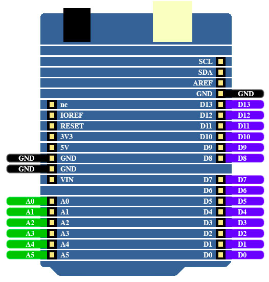
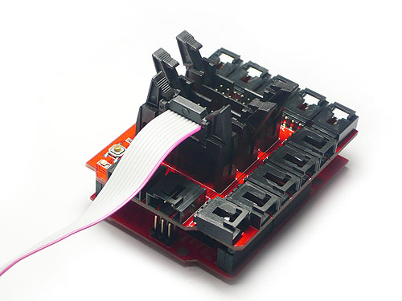
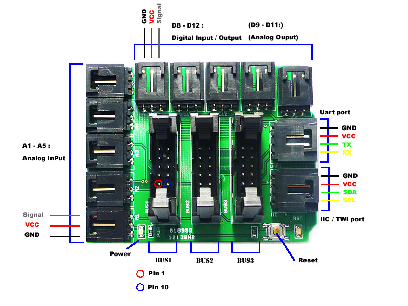
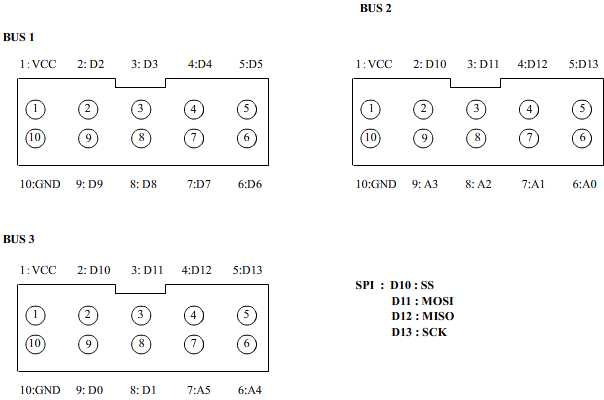
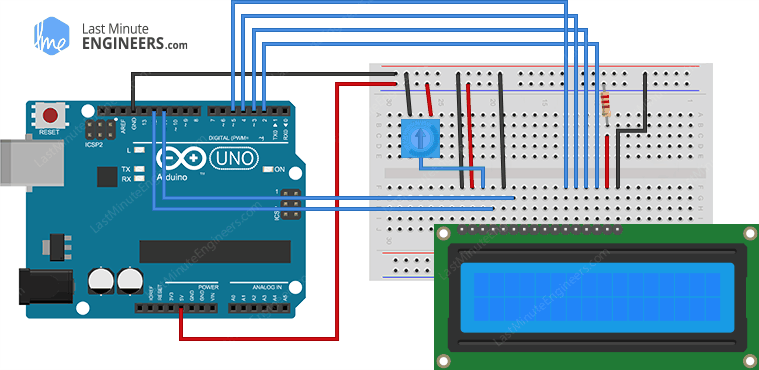

arduino
=======

All my arduino code

@todo use the followign ref: https://rastating.github.io/using-a-jhd162a-lcd-screen-with-an-arduino-uno/


Arduino uno
-----------



Seeduino sensor Chassis V1.1. X1
--------------------------------




All the connector have a connection to GND & VCC & SIGNAL

### A1
* Signal A1 - connect to analog 1
* VCC
* GND

A2

A3

A4

A5

IIC

UART

D8

D9

D10

D11

D12

### Bus


### Peripherals 

#### LCD 1602 (BUS)


The LCD bus wirings is as follow

| Bus 1 / Arduino Pin | JHD 162 A |
|---------------------|-----------|
| VCC | VCC |
| D2 | Enable |
| D3 | RW |
| D4 | Registery Select |
| D5 | Led + 5V |
| D6 | Led - Ground |
| D7 | N/A |
| D8 | D7|
| D9 | D6 |
| GND | VSS|

Classic code linking is matching the following schema



```arduino
LiquidCrystal lcd(12, 11, 5, 4, 3, 2);
```

According to the [documentation of lcd constructor](https://www.arduino.cc/en/Reference/LiquidCrystalConstructor) the constructor take at least 4 data bus pin d4-->d7


So we should have the following code with BUS 1

```arduino
LiquidCrystal lcd(4, 2, 5, 6, 7, 8);
```


```arduino
#include <LiquidCrystal.h>

LiquidCrystal lcd(12, 11, 10, 5, 4, 3, 2);

void setup()
{
  lcd.begin(16,1);
  lcd.print("hello, world!");
}

void loop() {}
```


